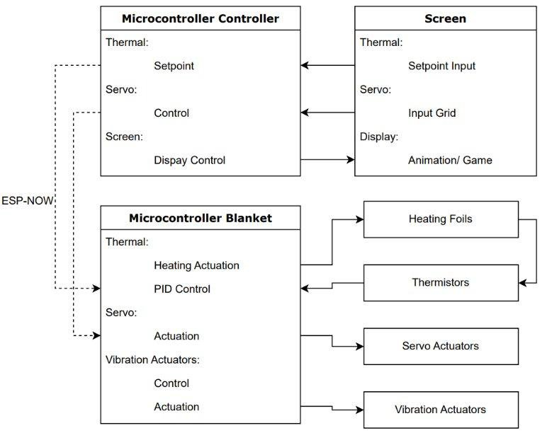
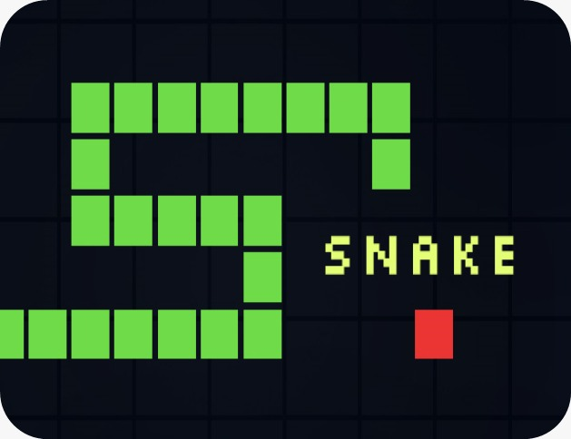
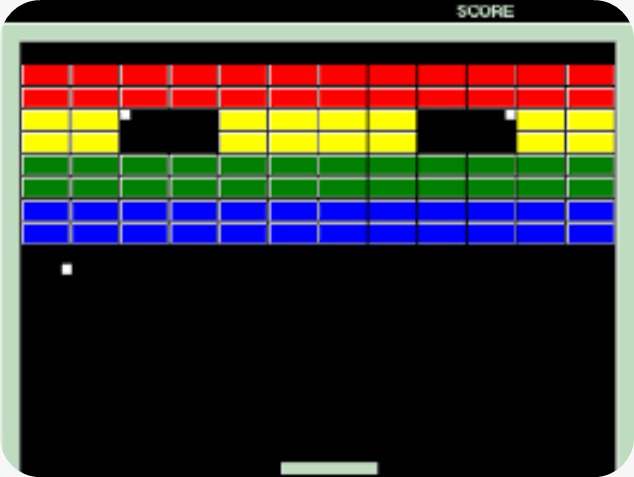
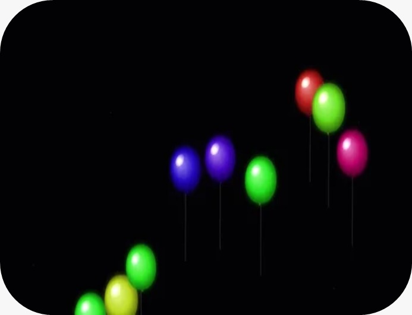

# Haptic Technology to Distract Small Children During Medical Procedures

**Course:** B-KUL-T4lMD2 Haptic Interfaces Experience — KU Leuven, Department of Mechanical Engineering  
**Authors:** Alexia Pires, Taiki De Wel, Thibaut Degreef  
**Supervisor:** Prof. Dr. ir. Carlos Rodriguez-Guerrero  
**Teaching Assistants:** Marlon Rodriguez, Ewald Ury  
**Academic Year:** 2025–2026

---

## 1. Introduction

Pediatric anxiety during medical procedures is common and can make care more difficult for both children and clinicians. Within clinical care frameworks like the 7P PROSA model at UZ Leuven [1], distraction is recognized as one of the most effective non-pharmacological strategies for reducing distress. This project targets children between 3 and 6 years old, an age group for which short attention spans, limited verbal communication, and high procedural fear make non-pharmacological distraction particularly valuable.

This project builds upon an ongoing master's thesis developed by Thibaut Degreef and Stan Vanherle at KU Leuven [2], focused on a multimodal haptic blanket for pediatric procedural comfort care. The thesis platform already included the weighted blanket, which has been shown to offer calming deep touch pressure that reduces anticipatory anxiety [3], alongside a servo-based pressure grid and vibrotactile actuator hardware. By stimulating specific low-threshold mechanoreceptors in the skin [4], this multimodal haptic approach aims to act as a physiological stress buffer, mimicking the soothing and regulating effects of social touch [5].

The contribution of this course project was the development of an interactive game layer running on a handheld ESP32-based interface. This included:

- IMU-based tilt interaction
- Touchscreen game development
- Real-time game logic
- Buzzer-based musical feedback
- Integration of these elements with the existing blanket platform through ESP-NOW communication

The child controls simple games through tilt and touch, while the system translates game events into synchronized haptic feedback on the blanket. The goal is to create a more engaging and multisensory distraction experience.

---

## 2. Hardware / Supplies

| Component | Quantity | Notes |
|---|---|---|
| ESP32-WROOM microcontroller | 2 | Master and blanket-side controller |
| MPU6050 IMU | 1 | Tilt input for the game controller |
| 4.0" TFT LCD (ILI9488) | 1 | Visual game interface |
| KY-006 passive buzzer | 1 | Game audio feedback |
| PCA9685 PWM driver | 1 | Servo signal generation / control |
| PCA9548A I2C multiplexer | 2 | I2C expansion and TacHammer addressing |
| Titan Haptics Drake TacHammers | 16 | Vibrotactile feedback in the blanket |
| MG90S servos | 16 | Pressure grid on the blanket |
| 5V high-current power supply | 1 | Dedicated actuator power |
| Breadboard, jumper wires, USB cables | 1 set | Prototyping and programming |

---

## 3. Wiring and setup

The TFT, MPU6050, and buzzer are mounted on the screen-side prototype board. The blanket-side system uses a dedicated 5V power rail for the servos and haptic drivers. The ESP32 is powered separately to avoid brownouts.

### Master ESP32 pin assignments

| Signal | GPIO |
|---|---|
| MPU6050 SDA | 21 |
| MPU6050 SCL | 22 |
| TFT MOSI | 23 |
| TFT MISO | 19 |
| TFT SCK | 18 |
| TFT CS | 15 |
| TFT DC | 2 |
| TFT RST | 4 |
| TFT BL | 32 |
| Touch CS (XPT2046) | 14 |
| Passive buzzer | 26 |

---

## 4. Methods

### 4.1 System architecture

The system uses two ESP32 boards:

- **Master node (screen side):** reads the MPU6050, runs the game logic, renders the UI on the TFT screen, and plays audio.
- **Slave node (blanket side):** receives ESP-NOW packets and drives the servos and vibrotactile actuators.

This wireless separation avoids cable strain and keeps the high-current actuator supply isolated from the handheld controller.

  
*Figure 1: System architecture showing Master (screen-side) and Slave (blanket-side) ESP32 nodes communicating over ESP-NOW.*

### 4.2 Input and calibration

The MPU6050 is calibrated at startup using a short static sampling phase. During runtime, accelerometer values are low-pass filtered (α = 0.12–0.15) to reduce jitter while preserving responsive tilt control. The gyroscope is intentionally not used at runtime: because the IMU is mounted upside-down inside the handheld unit, fast movements cause pitch and roll axes to cross-contaminate in the body frame. The accelerometer alone provides stable, drift-free absolute orientation.

### 4.3 Game layer

Three games run on the Master ESP32, all designed to be immediately understandable by children aged 3 to 6 without requiring reading ability or complex instructions. A simple state machine manages the games and the manual control screens inherited from the thesis platform.

| Game | Input | Core mechanic |
|---|---|---|
| Snake | IMU tilt | Navigate the snake to eat food, avoid walls and obstacles |
| Brick Breaker | IMU tilt | Move the paddle to bounce the ball and clear bricks |
| Balloon Pop | Touchscreen | Tap balloons before they float away; avoid bombs |

#### Snake

  
*Figure 2: Snake game running on the TFT display. The child tilts the handheld controller to steer the snake toward the red food item.*

#### Brick Breaker

  
*Figure 3: Brick Breaker game on the TFT display. The child tilts the controller to move the paddle and clear the coloured brick grid.*

#### Balloon Pop

  
*Figure 4: Balloon Pop game on the TFT display. The child taps rising balloons to pop them and must avoid the bomb balloon.*

### 4.4 Haptic mapping

Game events are translated into haptic patterns on the blanket. Because the physical wiring order of the 16 actuators does not match the visual 4×4 grid, all logical grid positions are routed through a lookup table (`TRIL_MAP`) before transmission.

#### Snake

Each step of the snake produces two simultaneous haptic signals. A servo pressure gradient, computed with bilinear interpolation across the 4×4 grid, continuously tracks the head position and shifts the pressure peak on the blanket as the snake moves giving the child a spatial sense of the snake's location. At the same time, a single vibrotactile motor fires at the position of the food item, acting as a spatial hint so the child can feel where the next target is before they see it.

When the snake eats food, all 16 servo motors pulse briefly to 90° and immediately return to zero a short, full-blanket squeeze that rewards the point. On a collision (self or obstacle), all servos cut to zero and the game-over jingle plays.

#### Brick Breaker

Brick Breaker uses the haptic system in two parallel ways. As the child tilts the controller to move the paddle, the servo grid continuously mirrors the paddle's column position: the column directly below the paddle extends fully while adjacent columns taper off with distance (`intensity = max(0, 1 − dist × 0.7)`), producing a pressure ridge that slides left and right in sync with the paddle. This runs at every update frame and gives a persistent pressure sensation that helps the child feel where the paddle is without looking.

Each time the ball destroys a brick, a single vibrotactile motor fires at the actuator spatially closest to that brick, so the pop is felt in the matching region of the blanket. Clearing all bricks triggers the win jingle and all servos return to zero.

#### Balloon Pop

Balloon Pop is entirely touch-driven. When a balloon is tapped and popped, two haptic events fire together: a vibrotactile motor at the quadrant matching the balloon's screen position activates at full intensity, and the servo gradient function simultaneously drives a pressure peak toward the same location, a localised squeeze-and-buzz that matches where the balloon was popped. Tapping a bomb balloon ends the game immediately: all actuators shut down and the game-over jingle plays.

### 4.5 Audio feedback

Audio is produced by a KY-006 passive buzzer on GPIO 26, driven through the ESP32's LEDC PWM peripheral. Volume is adjustable from the menu in ten discrete steps (0 = mute, 1–10), mapped to a PWM duty cycle between 3 and 127. All melody playback is non-blocking: the main loop calls `buzzerUpdate()` on every iteration, which advances to the next note only when its duration has elapsed, so audio never stalls the IMU reads, touch polling, or haptic output.

Each game has its own looping background melody:

| Game | Melody | Character |
|---|---|---|
| Snake | "Serpentine" (original) | Minor-key, ~150 BPM, E4–E5 range, rolling phrases |
| Brick Breaker | Korobeiniki (Tetris theme) | Upbeat, E major, immediately recognisable |
| Balloon Pop | "Cloud Pop" (original) | Slow, serene, A minor, long note values |

A shared descending game-over jingle (E5 down to E4) plays once at the end of any session, covering both loss conditions and the win condition in Brick Breaker.

### 4.6 Communication

Master and Slave communicate through ESP-NOW. The game sends compact packets containing the actuator state and temperature-related data. A separate temperature channel lets the caregiver monitor the thermal subsystem.

---

## 6. Discussion

The prototype demonstrates that a compact embedded system can combine game control, visual feedback, audio, and spatial haptics into a coherent distraction tool for children aged 3 to 6. All three games are deliberately simple no reading required, no complex rules so that a toddler can engage with them within seconds and a caregiver can hand the device over without explanation. This aligns with clinical best practice for procedural distraction, where a child's full attentional load should be directed at the distractor rather than at learning how to use it.

The multimodal design is medically meaningful beyond mere entertainment. The synchronized haptic feedback on the blanket occupies the somatosensory channel the same channel through which procedural pain (needle insertion, pressure from a blood pressure cuff) is processed. By filling that channel with non-threatening tactile input, the system aims to reduce the salience of the painful stimulus through competitive gating. The audio layer adds an auditory anchor that helps maintain attention even when the child briefly looks away from the screen, which is common at this age.

Among the three games, Brick Breaker produced the most expressive haptic behaviour. The continuously shifting servo gradient under the paddle gives the child a persistent pressure sensation tied to their own physical movement a form of proprioceptive feedback that is qualitatively different from the event-driven pulses of the other games. This spatial coupling between motor action and blanket response may be particularly effective for the 3–6 age group, where embodied, sensorimotor play is developmentally dominant.

The per-game audio melodies added an unexpected layer of identity to each mode. The Tetris melody and the descending game-over jingle are emotionally legible even to very young children an important property when the child should understand game state without reading text. The non-blocking buzzer architecture was essential: because melody updates share the main loop with touch polling and IMU reads, the system stays fully responsive throughout.

Several technical limitations remain. The passive buzzer produces a thin, monophonic tone. The fixed actuator lookup table requires manual updating if the blanket hardware is revised. ESP-NOW on a shared 2.4 GHz channel is susceptible to interference in hospital environments. Most importantly, the system has not yet been validated with the target user group.

---

## 7. Conclusion and future work

This project extends an existing pediatric haptic blanket with an interactive game interface and synchronized multimodal feedback. The result is a technically ambitious prototype that combines tilt-based interaction, wireless communication, haptic mapping, and caregiver-adjustable settings, specifically designed for children aged 3 to 6.

Future improvements include:

- Formal usability testing with children and clinicians. Structured play sessions with children aged 3–6, observed by clinicians, would identify which game mechanics are most engaging and which haptic patterns are most comforting.
- Higher-fidelity audio. Replacing the passive buzzer with a small speaker and an I2S DAC would allow polyphonic melodies and richer sound effects.
- Additional game modes. A rhythm game in which the child taps in time with the melody and the blanket pulses on the beat would further exploit the synchronized audio-haptic channel.
- Adaptive haptic intensity. A future version could use a lightweight biofeedback signal (e.g. heart rate) to automatically adjust stimulus intensity based on the child's real-time stress level.
- Robust wireless communication. Migrating to a dedicated frequency band would reduce interference risk in RF-dense hospital environments.

---

## 8. References

[1] UZ Leuven, "Pijn bij kinderen - wat doen we eraan?" (PROSA model). Available: https://www.uzleuven.be/nl/prosa  
[2] T. Degreef and S. Vanherle, "A Haptic-Centred Multisensory Distraction Device for Reducing Stress in Minor Medical Procedures," master's thesis, KU Leuven, 2026.  
[3] L. I. Stein Duker, R. McGuire, J. Hernandez, E. Goodman, and J. C. Polido, “Feasibility, acceptability, and perceived effectiveness of weighted blankets during paediatric dental care,” International Journal of Paediatric Dentistry, Sep. 2024, doi: https://doi.org/10.1111/ipd.13263.  
[4] Victoria E. Abraira and David D. Ginty, “The Sensory Neurons of Touch,” Neuron, vol. 79, no. 4, pp. 618–639, Aug. 2013, doi: https://doi.org/10.1016/j.neuron.2013.07.051.  
[5] I. Morrison, “Keep Calm and Cuddle on: Social Touch as a Stress Buffer,” Adaptive Human Behavior and Physiology, vol. 2, no. 4, pp. 344–362, Aug. 2016, doi: https://doi.org/10.1007/s40750-016-0052-x.  
